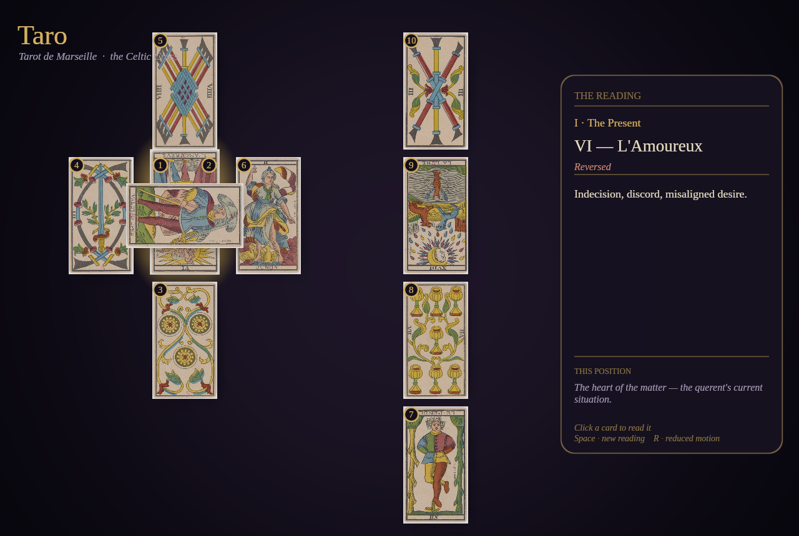
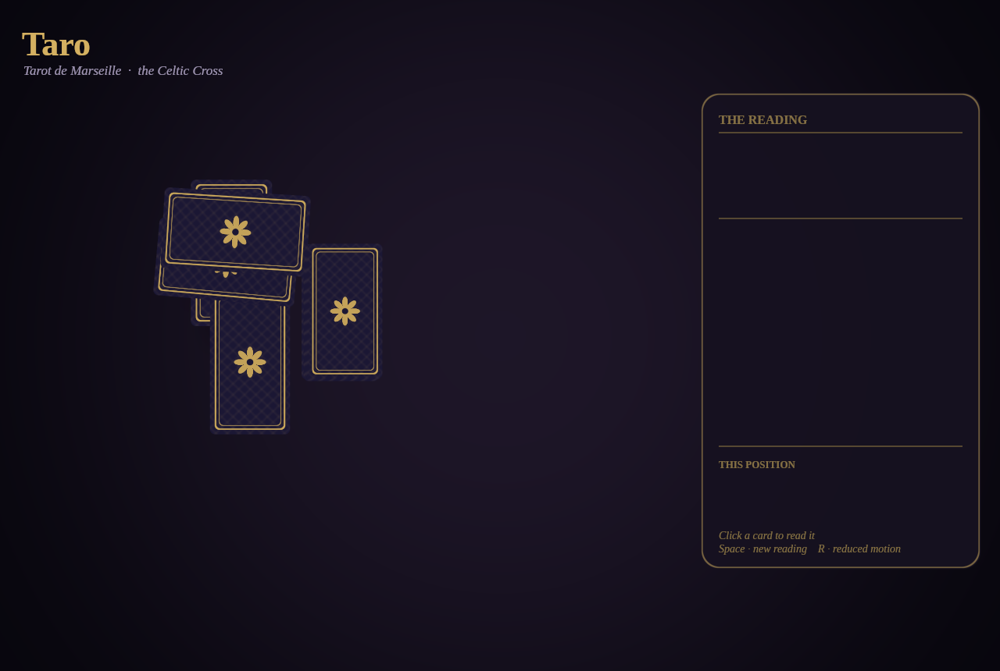

<div align="center">

# Taro

**An animated Tarot de Marseille fortune-telling app for the Linux desktop.**

Shuffle, deal a Celtic Cross, and watch the cards fly out and flip to reveal
their faces — then click any card to read it. Written in Rust on the
[Bevy](https://bevy.org) game engine, with a clean engine-agnostic core.



</div>

---

## What it is

Taro deals the **Celtic Cross**, the classic ten-card Tarot spread, using a
full 78-card **Tarot de Marseille** deck. Each reading is animated: the cards
deal from a face-down deck along eased arcs, flip up one by one, and settle into
the cross-and-staff layout. A side panel narrates the reading — the position,
the card that landed there, whether it fell upright or reversed, its meaning,
and the role that position plays in the spread.

The project is split in two:

- **`taro-domain`** — a pure, engine-agnostic core: the deck, shuffle/draw, the
  `Spread` abstraction (Celtic Cross is the first implementation), authored card
  meanings, and reading composition. Zero rendering dependencies, fully unit
  tested.
- **`taro-app`** — the Bevy presentation layer: a themed felt table,
  procedurally generated card backs and shadows, a hand-rolled tween system, the
  deal/flip animation, and the interactive reading panel.

## Features

- 🃏 **Full Tarot de Marseille deck** — 22 Majors + 56 Minors, with real
  public-domain card art.
- ✨ **Animated deal & reveal** — deck-stack → deal-along-arc → staggered
  flip-reveal, all hand-rolled (no animation dependency).
- 🔮 **Celtic Cross** with the crossing card laid sideways, and **reversed cards
  shown upside-down** — orientation made literal.
- 🖱️ **Click to read** any card; a gold halo marks your selection and the panel
  follows it.
- 📖 **Authored meanings** for all 78 cards, upright and reversed, plus each
  position's role in the spread. The panel never spoils a card before its flip.
- ♿ **Reduced-motion mode** — instant, animation-free placement.
- 🎨 **Procedural theming** — felt vignette, ornamental card back, soft shadows,
  and gold accents are all generated in code; the only bundled art is the card
  faces and a serif UI font.

<div align="center">

<br><em>Mid-deal: face-down cards fan out from the deck before flipping up.</em>
</div>

## Requirements

- **Rust** (stable, 2021 edition) — install via [rustup](https://rustup.rs).
- **A Linux desktop** with Wayland or X11.
- **A Vulkan-capable driver.** A real GPU is ideal; the Mesa software rasterizer
  (`llvmpipe`) works as a fallback, just slowly — prefer a release build there.

Taro deliberately uses a **curated Bevy feature set** that excludes audio and
gamepad support, so you do **not** need ALSA or libudev. Typical system packages:

| Distro | Packages |
| --- | --- |
| Fedora | `vulkan-loader mesa-vulkan-drivers libxkbcommon wayland libX11 libXcursor libXi libXrandr` |
| Debian/Ubuntu | `libvulkan1 mesa-vulkan-drivers libxkbcommon0 libwayland-client0 libx11-6 libxcursor1 libxi6 libxrandr2` |

(Build-time `-dev`/`-devel` variants of the X11/Wayland/xkbcommon libraries are
needed to compile.)

## Build & run

From the repository root:

```bash
# Run it (first compile takes a few minutes; subsequent runs are instant)
cargo run --release -p taro-app
```

Use `--release` if you're on software rendering (`llvmpipe`) — the debug build
is watchable but the release build is far smoother.

> **Note on assets.** Running through `cargo run` resolves the bundled art and
> fonts automatically. If you run the compiled binary **directly**, point Bevy
> at the asset root first:
> ```bash
> BEVY_ASSET_ROOT="$PWD/crates/app" ./target/release/taro-app
> ```

### Controls

| Input | Action |
| --- | --- |
| **Left-click a card** | Select it — gold halo, and the panel shows its reading |
| **Space** | Deal a new reading |
| **R** | Toggle reduced motion |
| **Close window** | Quit |

## Environment variables

| Variable | Effect |
| --- | --- |
| `TARO_REDUCED_MOTION=1` | Start in reduced-motion mode (instant placement) |
| `TARO_SELECT=N` | Pre-select reading entry `N` (0–9) |
| `TARO_CAPTURE=path.png` | Screenshot the window once and exit (see below) |
| `TARO_CAPTURE_AT=secs` | When to capture, in wall-clock seconds (default `3.0`) |
| `TARO_REDEAL_AT=secs` | Fire one automatic redeal at the given time (debug) |

The capture variables exist because Taro is developed in a headless, GPU-less
environment: since "does it look right?" can't be judged from logs, the app can
render a deterministic frame and exit, so a screenshot can be read back and
inspected. Tweens are keyed to elapsed time, so `TARO_CAPTURE_AT` selects a
precise animation frame.

```bash
# Grab the settled spread to a PNG and exit
BEVY_ASSET_ROOT="$PWD/crates/app" TARO_CAPTURE=shot.png TARO_CAPTURE_AT=5 \
  ./target/release/taro-app
```

## Project layout

```
taro/
├── crates/
│   ├── domain/                 # taro-domain — engine-agnostic core
│   │   ├── src/
│   │   │   ├── card.rs          # Card, Suit, Rank, Orientation, Majors table
│   │   │   ├── deck.rs          # Deck::full(), shuffle, draw
│   │   │   ├── spread.rs        # Spread trait, LayoutSlot, PositionDef
│   │   │   ├── spreads/         # celtic_cross.rs (first spread)
│   │   │   ├── meanings.rs      # CardMeaning, embedded RON loader
│   │   │   └── reading.rs       # build_reading()
│   │   ├── data/meanings.ron    # authored upright/reversed meanings (78 cards)
│   │   └── tests/domain.rs      # deck/meaning/spread invariants
│   └── app/                    # taro-app — Bevy presentation
│       ├── src/
│       │   ├── main.rs          # app wiring, deal/redeal
│       │   ├── layout.rs        # slot → world transform mapping
│       │   ├── theme.rs         # palette, fonts, window size
│       │   ├── textures.rs      # procedural vignette/back/shadow/glow/panel
│       │   ├── cards.rs         # card + shadow + badge spawning
│       │   ├── tween.rs         # hand-rolled tween/flip/fade system
│       │   ├── panel.rs         # reading panel + title
│       │   ├── interact.rs      # click-to-select, redeal, highlight
│       │   └── capture.rs       # deterministic screenshot harness
│       └── assets/
│           ├── cards/           # 78 PNG card faces (+ SOURCE.md)
│           └── fonts/           # Liberation Serif (+ SOURCE.md)
├── scripts/fetch_cards.py      # re-download card art from Wikimedia
├── PLAN.md                     # architecture & roadmap
└── docs/img/                   # README screenshots
```

### A note on the animation system

`bevy_tweening` trails two Bevy releases behind (it targets Bevy 0.15; Taro is
on 0.18), so animation is hand-rolled in `tween.rs`: a handful of easing curves
and driver systems for transform tweens, two-stage flips, and fade-ins, all
keyed to `Time::elapsed_secs()`. Frame-rate (even on software rendering) affects
only smoothness, never a tween's duration or final resting state.

## Development

```bash
cargo test --workspace      # domain invariants + the click hit-test geometry
cargo clippy --workspace    # lints (the tree is warning-clean)
```

Visual changes are verified with the capture harness described above: render a
deterministic frame to a PNG and inspect it.

## Card art & fonts

- **Card faces** come from Wikimedia Commons, category *"Tarot de Marseille
  (Single Cards)"* — a complete public-domain scan set (`PD-US-expired`). They're
  renamed to match `taro_domain::Card::id()` so they resolve automatically. Run
  `python3 scripts/fetch_cards.py` to regenerate them. See
  [`crates/app/assets/cards/SOURCE.md`](crates/app/assets/cards/SOURCE.md).
- **UI font** is **Liberation Serif** (SIL Open Font License). See
  [`crates/app/assets/fonts/SOURCE.md`](crates/app/assets/fonts/SOURCE.md).

## Roadmap

- [x] **Phase 0–1** — project skeleton, engine-agnostic domain core (tested).
- [x] **Phase 2** — static Bevy render of a dealt Celtic Cross with real art.
- [x] **Phase 3** — animation & theming: deal/flip, procedural textures, reading
      panel, interaction, reduced motion.
- [ ] **Phase 4** — free-text question and a composed full-reading view.
- [ ] **Phase 5** — optional AI "deeper reading" (Claude API, streaming).
- [ ] **Phase 6** — more spreads, sound, AppImage/Flatpak packaging.

See [PLAN.md](PLAN.md) for the full design.

## License

Licensed under either of [MIT](LICENSE-MIT) or [Apache-2.0](LICENSE-APACHE) at
your option. The bundled **card art is public domain**; the **Liberation Serif**
font is under the SIL Open Font License (see its `SOURCE.md`). These third-party
assets keep their own terms and are not covered by the project license.

## Acknowledgements

- The [Bevy](https://bevy.org) engine and community.
- Wikimedia Commons contributors for the public-domain Marseille scans.
- The Liberation Fonts project (Red Hat).
